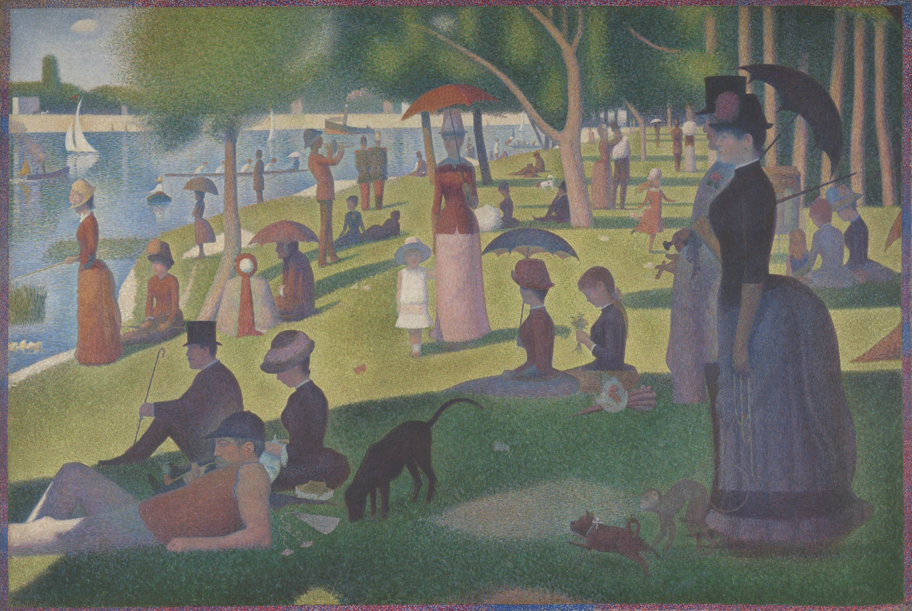

# Creative coding major project
## Part 1: Interaction Instructions
### Automatic Wave Animation 
The whole canvas will auto-undulate wave-like when the page loads. Besides, it changes direction automatically from time to time. To such an effect, each dot's size has changed, which provides the image with rhythmic flow and leaves an impression of gentle, soothing motion like waves.
### Mouse Interaction
Click anywhere within the canvas to create a ripple effect from the point of impact, just like a small stone dropped into water.
### Responsiveness of Screen Size: 
Animation and display are responsive for your screen size, if you make a bigger browser window, the picture will automatically adapt to being kept in the center and balanced on your screen.

## Part 2: Individual Animation Approach
For my individual approach, I used a Time-Based animation technique to create a wave effect reminiscent of pop art’s bold, rhythmic patterns, adding a modern twist to the impressionist painting. Here’s how it works
### Wave Animation Driven by Sinusoidal Oscillation 
Each dot’s size changes periodically by calculating a phase value that combines its position (x and y) with the animation frame count (frameCount * waveSpeed). By applying a sinusoidal function (sin(phase)), each dot oscillates in size, creating a flowing, wave-like effect across the entire image. This effect mimics the repetitive dot patterns of pop art, lending the piece a modern aesthetic.

### Size Variation with Easing Using lerp
The lerp function, along with the easing factor, makes each dot’s size change gradually and smoothly. The easing factor (set at 0.1) controls how quickly each dot’s current size catches up to its target size. In each frame, lerp calculates a step closer to the target, so the dot’s size shifts a bit at a time. A lower easing factor means slower, smoother changes, which gives the whole animation a more natural, wave-like flow as the dots expand and contract. This easing effect is really what makes the animation feel fluid and cohesive.

### Mouse Interaction: Creating Ripple Effects 
When you click on the canvas, a function generates a new instance of the Ripple class at the mouse’s position. This ripple starts with a small radius and gradually expands outward, simulating a wave spreading from the click point. The Ripple class manages this expansion by steadily increasing the ripple’s radius property, giving the ripple a smooth, outward flow.

Each ripple has a set lifespan of 5 seconds. Inside the Ripple class, I used setTimeout to mark each ripple as “finished” after 5 seconds. Once marked, the ripple is removed from the active animation, which keeps the display clear by preventing too many ripples from building up on screen. For interaction with the dots, I used the dist function to measure the distance between the ripple’s center and each dot on the canvas. When a dot falls within the ripple’s radius, its size temporarily increases to the maximum, creating the effect of the wave passing through it.

## Part 3： Differences from Other Teammates
By blending sinusoidal oscillation, lerp-based easing, and timed ripple effects, my approach brings a pop-art-inspired, modern twist to the impressionist artwork, giving it a unique feel compared to my teammates' techniques. One teammate used Perlin noise to create a surreal, twisted effect across the canvas, evoking Van Gogh’s brushstrokes but with an eerie, abstract feel. Another teammate added an interactive element by simulating the process of unlocking a tablet screen, giving the piece a touchscreen-like experience. A third teammate used audio input to drive the animation, so the visuals respond dynamically to the volume and rhythm of the music. My approach reinterprets the impressionist image with rhythmic dot patterns and smooth easing transitions inspired by pop art, adding a fresh, modern feel.

## Part 4： Inspiration Behind the Animation

For my animation, I decided to work with a painting by Claude Monet, one of the most iconic impressionist artists. Impressionism has this unique, soft, slightly blurry style that creates a sense of beauty through subtle abstraction. Monet’s Saint-Georges majeur au crépuscule captures that perfectly, with gentle transitions and delicate details.

I was also inspired by pointillism, especially Georges Seurat’s work, where he used tiny, distinct dots to create lively scenes. I wanted to capture that same idea of using dots but with a fresh, modern twist. Adding to that, pop art, especially Roy Lichtenstein’s famous repetitive dot patterns, influenced me to give the animation a more contemporary feel.

  *Georges Seurat's "A Sunday Afternoon on the Island of La Grande Jatte"* 

 Lichtenstein’s bold, graphic dots are a strong contrast to Monet’s soft brushwork, but combining them allowed me to create a unique effect—a blend of modern energy with that soft, dreamy quality of impressionism.
 
 *Roy Lichtenstein's "Sunrise"* 

All of these influences led me to transform Monet’s painting into a rhythm of pulsing dots. This mix of styles adds a pop-art flair to the piece while still keeping that impressionist sense of mystery and abstraction.

## Part 5: Technical explanation and references ##
I incorporated the JavaScript splice() method and p5.js createVector() function, which are outside the course material, to enhance code performance and simplify logic. Initially, not using splice() meant that previously generated ripple objects remained in the array indefinitely, consuming memory and causing the animation to lag. By removing finished ripples from the array with splice(), we freed up memory resources, allowing the animation to run smoothly. Using createVector() to create vector objects simplified the management and calculation of point positions, making it more efficient than handling x and y values separately, and resulting in cleaner, more readable code.